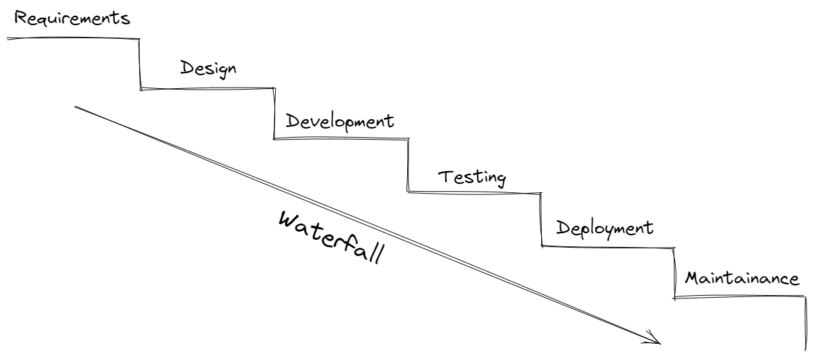
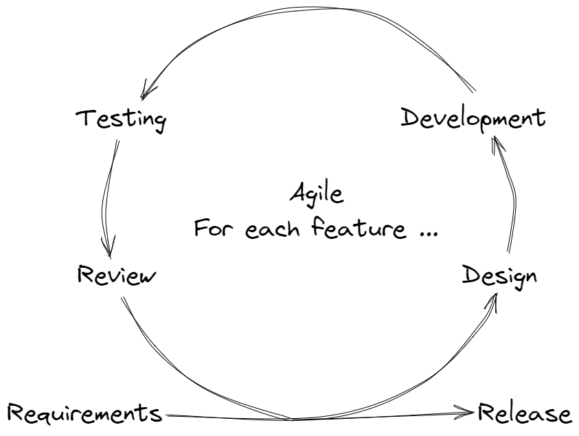
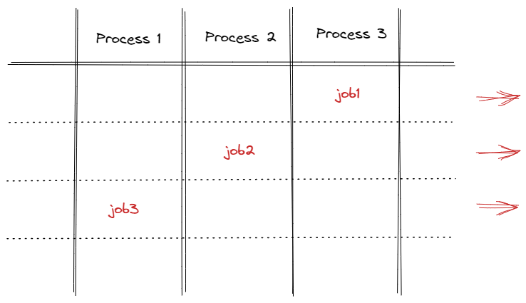
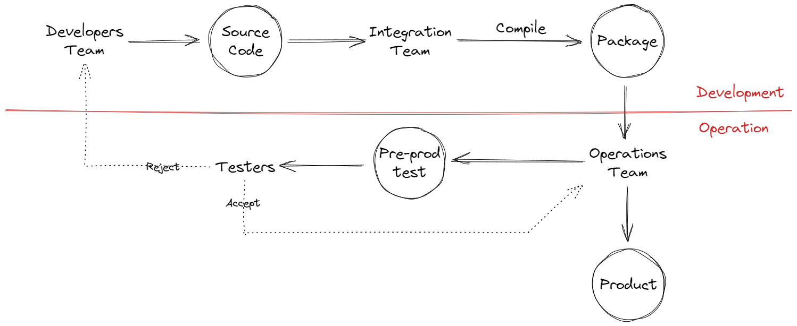
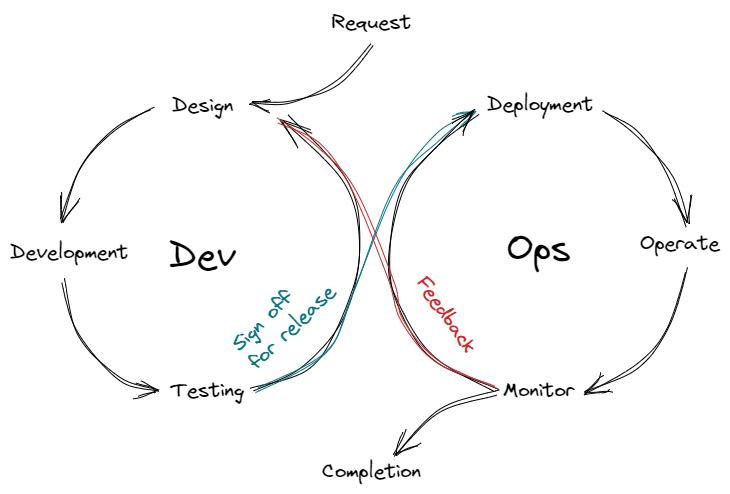

# Project: Morse Code Converter
This project practices CI/CD by developing a Morse code converter program that is implemented on an Arduino UNO Rev 3. The purpose of this project is not making anything useful or meaningful, but just to get familiarized with CI/CD and Arduino IDE.

A quick review of CI/CD and DevOps are given as follows. The notes are based on John Honai, DevOps, CI/CD for Beginners, Udemy. Figures are plotted using [Excalidraw](https://github.com/excalidraw/excalidraw "github.com/excalidraw/excalidraw").

## Introduction to CI/CD and DevOps

### Agile

Agile refers to a project management methodology used for software development. 

#### Concepts

The counterparty of agile is the more conventional waterfall model.

Waterfall model refers to the system development procedure where the developers develop and deliver the entire software as a whole, regardless of how many sub packages or functions that the software may contain. After the customers raise the requests to the developers, they do not communicate very often until the entire software is developed. The entire development follows a straight line from one end to the other, or a waterfall from top to the tail, hence the name, waterfall.

As requests from the customers start to vary frequently (sometimes the requests can change everyday), the disadvantages of using waterfall model are revealed. 

One of the biggest issue is that it may be difficult to make even the smallest change to the entire system, when it is delivered as a whole. Indeed, all the backend variables and databases might be interconnected with each other. As a result, a minor change in the request may result in the changes multiple parts of the software. 

When a new feature is developed in the dev environment, integrating it with the existing system running in the production environment is also challenging because everything is coupled together. Sometimes this can be done only during a shutdown period, and it can take up to a few hours.

Agile is proposed to address these issues. A very important feature of agile, comparing with waterfall, is that **it allows deployment of systems and rapid updates of features to the systems in a convenient and organized way**.

In agile architecture, each feature is separately modularized. Each feature, before deploying and integrating into production environment, circulates in its own “development and testing circle”, where it can be tested and reviewed iteratively by the developers and the customers, as shown below.

Should there be any adjustment to the feature, just brings back the circle and improve the feature here, before releasing it to the production environment again.

Since modification becomes much easier in the agile development than in the waterfall development, agile development allows feedbacks collected during the development to be better reflected in the product. Whereas for waterfall development, it is more likely to stick to the original design.

In parallel development where there are multiple features running in their associated circles, the developer can easily choose which circles to prioritize. This gives the developer a clearer overview of what is happening and how to best answer to the customers immediate requirements.

#### Roles and Responsibilities

On top of the agile development philosophy, roles and their responsibilities used in the development are defined. These roles may differ depending on the project management conventions in the team. The most commonly seen approach, namely scrum, is introduced here. 

Key roles used in scrum are summarized as follows.

| Role | Description |
| --- | --- |
| Product owner | The ultimate person in charge for the software. He is usually the person who understands all the requirements of the product, and can sign off the developed features.
This person is usually from the customer team who raises the request of developing the software. |
| Scrum master | Project leader from the developer team. |
| Developer | Software developer. |
| Tester | Software tester. |
| Operator/Support | Software operator, support, and maintenance team. |

The product owner and scrum master come up with the product backlog, which clarify the sprints (tasks) and their priorities. The team then know which sprint they shall work on first.

For each sprint, sprint planning and sprint backlog are proposed that describes the schedule of the sprint. The team works on the sprint and host daily scrum meetings until the sprint is solved. Upon finishing of a sprint, sprint review is hosted that reviews and summarizes how the task is done.

### Continuous Integration and Delivery/Deployment (CI/CD)

#### Pipeline

Pipeline is a set of data processing elements connected in series, where the output of the upper stream processing is the input of the down stream processing. An example is shown below.

By using a pipeline and let multiple pipelines at different execution phase run in parallel, the efficiency of the system is increased.

Pipeline is used in both CI and CD.

#### Continuous Integration

In the development of a sprint, new codes are rapidly developed, and they are rapidly compiled, packaged and tested. Conventionally, the cycle requires involvement from multiple parties, thus slowing down the development. A demonstrative figure is shown below.

This entire procedure often takes a few weeks or months, just for one change or add-on to be published to the product environment. If a sprint contains multiple changes or add-ons to be integrated to the system in multiple phases, it can take very long time for a sprint to complete.

The latency of the iteration comes from the following aspects:

- It takes time for the integration team to integrate different branches in the source code together, making sure that components from different branches function properly.
- When there is a defect, the flaws can be spotted only in the last stage of the iteration, i.e., testing.

CI tries to solve the above problems. 

Firstly, CI requires developers from different branches to integrate code into a shared centralized branch several times a day, making sure that their programs are compatible and integrated all the time. This essentially relocates the integration team’s workload to the developers team. In practice, since developers are the best at their codes, by letting them handle the code merging, it saves time in total.

Secondly, a build server is used to compile the source code into packages automatically whenever any commit or merge are made to the source code centralized branch. Developers have access to this server to oversee the compiling. Should there be any compilation error, notification is pushed to the developers immediately.

Lastly, upon compiling the code, the latest packages are immediately tested in the build server automatically. Both functions and interfaces of the new packages are tested. The test results are communicated to the developers immediately.

The above procedures (second and final) form the development pipeline.

#### Continuous Delivery/Deployment

The sophisticated testing and deployment of the software features are done by the operations team.

Conventionally, operations team receives the updated package together with an instruction from the developers team. The instruction describes how the package shall be installed, and what test cases to use to carry out the test.

The operations team need to understand the instructions, and configure the pre-prod environment accordingly for the testing. The testers then uses varieties of scenarios to test the performance of the software. Bugs, if any, are reported to the developers team. If no bugs are spotted, the testers notify the operation team to release the package into production environment.

Some drawbacks of the above procedures are:

- The developers team needs to give detailed and precise instruction to the operations team, and the developers may make mistakes or missing something in the instruction, especially regarding environment configuration.
- Too many human interactions, which slow down the process and generates human error. The entire procedure usually take about a whole day.

Continuous delivery is a software development practice that allows software to be released to production at any time. The key philosophy is that, under CI infrastructure, the code should be always ready to be released.

Firstly, form the instruction file using computer languages, so that the configuration of environments and installation of packages can be done automatically. Technologies such as containerizations can help with this procedure.

Secondly, all the test scripts shall be pre-programmed, so that they can be executed automatically. If no bugs are detected in the test, the package is to be released automatically.

Both instruction files for environment setup, package installation, and testing plan, can all be stored and managed in the repository together with the source code. The operation team can now join the developers team. They are essentially all working on codes, just with some differences in the focusing areas.

The above procedures form the release pipeline, and it makes it technically possible to release a package to production environment at any time. In practice, there is often still the quality insurance team that sign off the packages before the release, just in case.

#### CI/CD and DevOps

A complete CI/CD flow is given below. Since the operation team joins the developers team, they are now called the DevOps team.

In this cycle, clearly, the testing and sign off for release is the last stop before the code is released to the production environment. Only senior developers shall have the right to merge and commit the master branch, and sign off the code for release.

The above CI/CD infrastructure enables short development cycle and fast deployment of a new package. For example, using the above structure, large IT companies can make up to dozens of new releases everyday!
